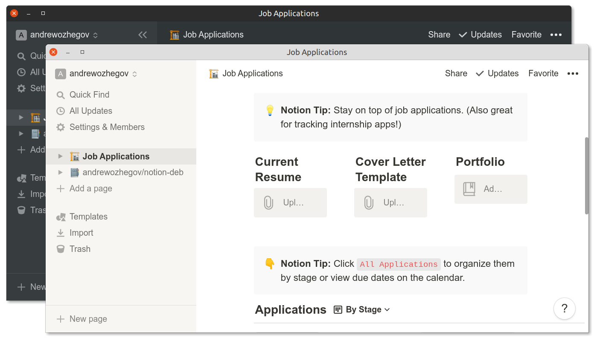

# Notion Linux App

Notion.so wrapped in electron desktop application using 'jiahaog/nativefier'



### Requirements

```
git
docker
make
```

### Install

do build and install electron application on host system

```bash
sudo make install
```

### Uninstall

delete all application files

```bash
sudo make uninstall
```

some stored by electron app data like cache, sessions & cookies should be deleted manually

```bash
rm -rf ~/.config/notion
```
